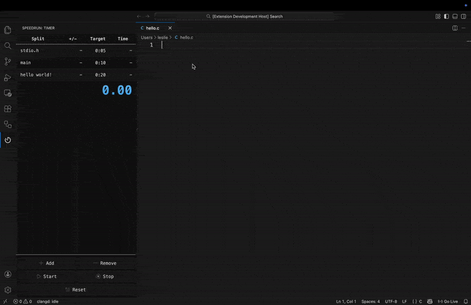

# speedrun

## About

Ever wanted to speedrun programming? No? Anyway, here's a LiveSplit-style speedrun timer for VS Code.

Use this for:

- Speedruns
- Timeboxing
- Productivity-maxxing

Other than the buttons, you can use shortcuts to:

- Start/Split: `crtl+k crtl+g`
- Stop: `crtl+k crtl+h`
- Reset: `crtl+k crtl+j`

## Attributions

- Timer icon created by [fjstudio - Flaticon](https://www.flaticon.com/free-icons/timer)
- Hourglass icon created by [Freepik - Flaticon](https://www.flaticon.com/free-icons/hourglass)
